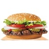

# royale-with-cheese


- Alright, when you .... into a movie theatre in Amsterdam, you can buy beer. And I don't mean in a paper cup either. 
They give you a glass of beer. And in Paris, you can buy beer at MacDonald's. And you know what they call a 
Quarter Pounder with Cheese in Paris?


- They don't call it a Quarter Pounder with Cheese?

[hello.txt](files/hello.txt)
- No, they got the metric system there, they wouldn't know what the fuck a Quarter Pounder is.

[hello.txt](/files/hello.txt)
- What'd they call it?


- They call it Royale with Cheese.

[iconmoon](https://icomoon.io/app/#/projects)
- Royale with Cheese. What'd they call a Big Mac?


- Big Mac's a Big Mac, but they call it Le Big Mac.


- Le big Mac! Ahhaha, what do they call a Whopper?

[Enzyme](https://devhints.io/enzyme)
- I dunno, I didn't go into a Burger King. But you know what they put on french fries in Holland instead of ketchup?

[Bash](https://devhints.io/bash)
- What?

[search](https://google.com/)
```js
const Mayonnaise = "Goddamn!"
```
| **col1** | **col2** |
| ----------| ------- |
| val1      | val2    |

- [StyleGuidist](https://react-styleguidist.js.org/examples/basic/)
- [StyleGuidist - cookbook](https://react-styleguidist.js.org/docs/cookbook.html)
